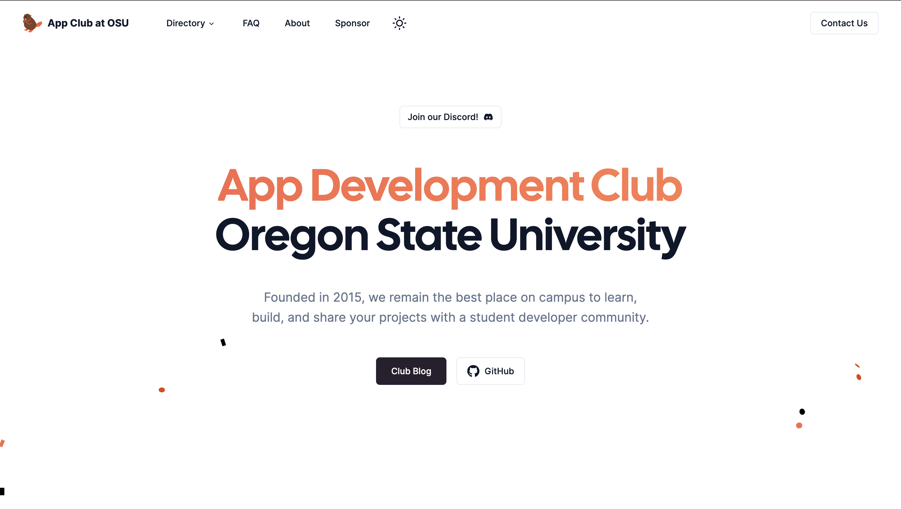

# App Development Club Website

Source code for the official website for the App Development Club at Oregon State University. It is built using [Astro](https://astro.build) and [Shadcn UI](https://ui.shadcn.com/). Our legacy website is still available at [osuapp.club](https://appdove.wixsite.com/club).



> **Warning**
> This app is a work in progress. Our club is actively working on this project.
> See the roadmap below.

## Project Structure

```
├── public/
│   └── fonts/
├── src/
│   ├── components/
│   ├── config/
│   ├── content/
│   ├── hooks/
│   ├── icons/
│   ├── layouts/
│   ├── lib/
│   ├── pages/
│   ├── styles/
│   └── types/
├── astro.config.mjs
├── README.md
├── package.json
├── tailwind.config.cjs
└── tsconfig.json
```

## Features

- Config files
- Views Transitions API
- Routing and Layouts
- React components & hooks
- Desin system built using **shadcn/ui**
- Documentation and blog using **MDX** and **Content Collections**
- Styled using **Tailwind CSS**
- Validations using **Zod**
- Written in **TypeScript**
- 100/100 Lighthouse score
- RSS Feed support

_In Progress:_

- Sitemap support
- Data Fetching
- SEO component
- API Routes and Middlewares
- Authentication using **Auth.js**
- ORM using **Prisma**
- Database on **PlanetScale**
- 0% JavaScript

## Roadmap

- [x] Dark mode
- [x] Add Markdown & MDX support
- [x] Sheet mobile nav
- [ ] Add search support for blog
- [ ] Add OG image for blog and others
- [ ] Add SEO component & metadata

## Running Locally

1. Install dependencies using pnpm, bun, or npm (pick one):

```sh
pnpm install
bun install
npm install
```

2. Start the development server:

```sh
pnpm run dev
bun dev
npm run dev
```

## License

Licensed under the [MIT license](/LICENCE.md).
